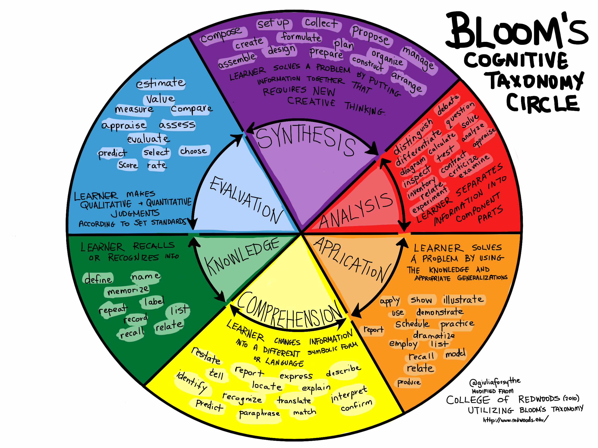

# On How to Learn

## Principle

- Golden circle model: why, how, what
- Pareto principle
- Consistency
- Bloom's taxonomy

### Bloom's taxonomy

- Types of knowledge: factual, conceptual, procedural, metacognitive
- Learning objectives: remember, understand, apply, analyse, evaluate, create

## Technique
- Active recall
- Analogies, metaphors, and mnemonics
- Deliberate practice
- Progressive overload
- Feynman technique
- Interleaved practice
- Practice testing
- Reflection
- Spaced repetition
- Structured repetition
- Immersion

## Not good
- Rote learning
- Cramming